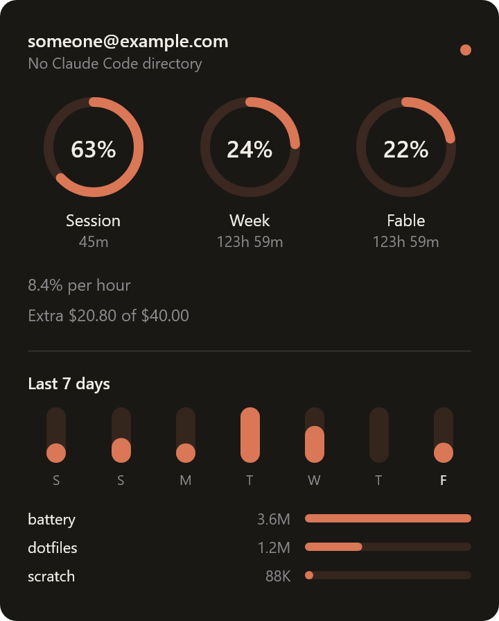
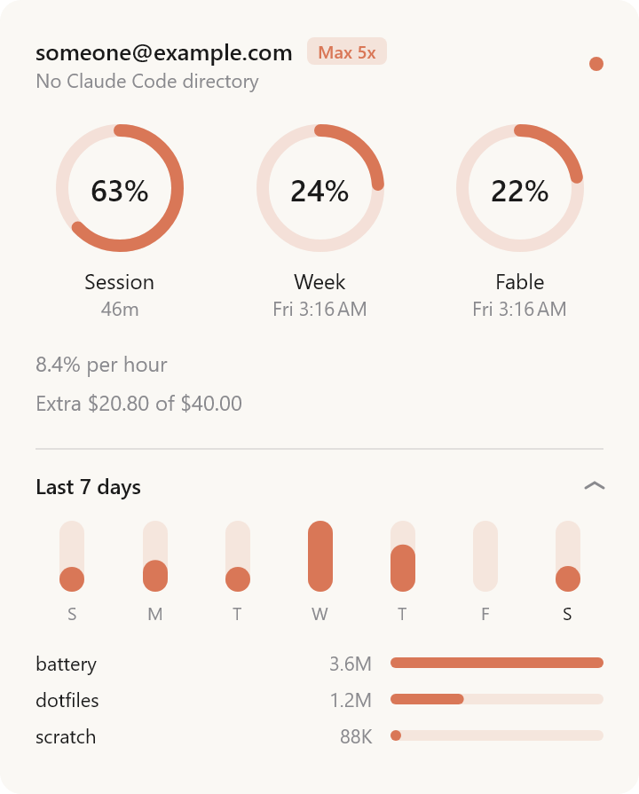

# Battery for Windows — tray icon, flyout panel, and the WSL problem

The fourth surface, after the macOS menu bar, the iPhone, and Android. Same
OAuth client, same `/api/oauth/usage` endpoint, same terracotta.

The headline difference from macOS is one line:

```
the files Battery reads are not on this machine
```

On a Mac, Claude Code's credentials, `stats-cache.json`, `projects/` and
`history.jsonl` sit in the same filesystem as the app that reads them. On
Windows a large share of Claude Code users — the author included — run Claude
Code **inside WSL**, so all of it lives across a 9P network redirector at
`\\wsl.localhost\<distro>\home\<user>\.claude`.

Everything below follows from that one fact.

| | |
|:--|:--|
|  |  |

Rendered by `--screenshot`, which draws the panel through the same Skia path a
real window uses — so these are the actual rendering, not a mockup, and no window
is opened to produce them.

---

## Reading the file boots the machine

Accessing a `\\wsl.localhost` path **starts the distro if it is not running.**

A tray app that reads a credential every sixty seconds would therefore boot a
Linux VM and hold roughly a gigabyte of RAM, on a machine where the user may not
have opened a terminal all day. That is disqualifying behaviour for something
that lives in the notification area, and it is not the kind of bug that shows up
in a screenshot — the app would look perfect while doing it.

Three rules keep it from happening, and each one already had a home in `core`:

**Probe, never assume.** `wsl.exe -l --running -q` lists running distros without
starting any. Nothing touches a WSL path unless that probe named the distro
first. Its output is **UTF-16LE with CRLF** — verified by hexdump rather than
assumed — so it must be decoded explicitly. Read with the JVM's default charset
it becomes a NUL-interleaved string that compares equal to nothing.

**Do not re-read credentials on the poll.** The access token is cached in
memory; the file is re-read only as expiry approaches. `StoredTokens.isExpiringSoon`
and `AppConfig.TOKEN_REFRESH_LEEWAY_SECONDS` already model exactly this, so the
credential file is touched every few hours rather than every minute.

**Gate local history on the panel.** Streaks, the heat map, the seven-day chart
and the project breakdown are read when the panel opens, not on a timer. Nobody
needs a heat map recomputed behind a closed window.

### The probe is side-effect free. Demonstrated, not assumed.

The first of those three rules is the one the other two rest on, and until now it
had never actually been tested. Ubuntu was running throughout Phase 1, so the
probe had only ever been asked about a distro that was already up — which cannot
distinguish *does not start one* from *did not need to*. Settling it needs a
second distro that is definitely down, so one was installed and never launched:

    wsl --install -d Debian --no-launch

| | |
|:--|:--|
| `wsl -l --running -q`, five times | Debian stays **Stopped**, and is correctly absent from the output |
| Reading `\\wsl.localhost\Debian\etc\os-release` | Debian goes **Running** |
| `wsl --terminate Debian`, then three more probes | Debian stays **Stopped** |

The middle row is the control, and it is what makes the other two mean anything:
the same machine, seconds apart, does start the distro the moment something
touches its filesystem. The probe is therefore quiet by demonstration rather than
by absence of evidence, and it is quiet both for a distro that has never run and
for one that has been terminated.

The control also sharpens the rule above it. That path read **failed** — a distro
with no user account yet answers 9P with an I/O error — and the distro booted
anyway. It is naming the path that starts the VM, not reading it successfully, so
there is no such thing as a cheap failed attempt.

## `.liveUnavailable` stops being an edge case

macOS treats an unreadable Claude Code credential as a rare accident: a denied
keychain prompt, a renamed directory. The fix in `32b7451` made the lookup
three-state so that a mapped account never falls through to Battery's own token
store — because falling through mints a second refresh chain, and single-use
refresh tokens mean one of the two copies is then stranded.

On Windows that "rare accident" is **a daily, routine, entirely correct state**:
the distro is simply shut down. The same three-state lookup ports unchanged and
carries far more weight here. Only the wording changes — not "credential
unreadable" but "Ubuntu isn't running", which is a fact about the user's machine
rather than an error about Battery's.

## What Windows-native Claude Code does

Probed on a real install rather than assumed, the way `ClaudeConfigDir` pins
Claude Code's config layout:

| | |
|:--|:--|
| `%USERPROFILE%\.claude.json` | **Present, with a complete `oauthAccount` block** — `accountUuid`, `emailAddress`, `organizationName`. `ClaudeConfigDir.identity(fromConfig:)` parses this shape today and ports with no changes. |
| Location of that file | *Beside* `%USERPROFILE%\.claude\`, not inside it — the same special case macOS already carries for `~/.claude.json`. |
| Credential Manager | **No entry.** `cmdkey /list` names nothing matching `claude`. |
| `%USERPROFILE%\.claude\.credentials.json` | Absent on the probed machine, which had a stale native install. |

So the credential bridge is a **plaintext file read on both paths**, WSL and
native. There is no keychain, no `CredRead`, no permission prompt — this is the
one place Windows is simpler than macOS rather than harder.

The Windows `oauthAccount` block also carries fields no client currently reads —
`hasExtraUsageEnabled`, `userRateLimitTier`, `organizationRateLimitTier`,
`billingType`, `seatTier`. That is a free local signal for plan-tier detection
that the desktop app presently infers, and it would improve macOS too.

---

## Sharing `core`

`core` is **not copied and not moved.** `settings.gradle.kts` mounts
`../android/core` into this build by redirecting `projectDir`:

```kotlin
include(":core")
project(":core").projectDir = file("../android/core")
```

Two things that look like alternatives are not:

**`includeBuild("../android")`** — a composite build has to evaluate the
included build's settings, which applies AGP and demands an Android SDK. A
Windows machine that only wants the desktop app would fail for no benefit.

**Promoting `android/core` to a root `core/`** — structurally honest once two
platforms share it, and wrong for this fork today. Android work here is
upstreamed to `allthingsclaude/battery`, where a root `core/` does not exist;
moving it would make the Android tree diverge and every future Android PR
harder. Worth proposing upstream as its own change once there is a shipped
Windows app to justify it. Until then the cost of borrowing is one comment.

This works only because `../android/core/build.gradle.kts` is honestly
Android-free — `kotlin-jvm`, one runtime JSON dependency, nothing else. **That
file is the contract.** Its own comment already names the line to defend: *"the
moment this module needs `android.*`, the shared fixture story is over."* This
build is what that discipline bought.

Two consequences worth knowing:

- The version catalog here **must** define `kotlin-jvm` and
  `kotlinx-serialization-json` under the same aliases as `android/`, because this
  build resolves `../android/core/build.gradle.kts` against *this* catalog.
  Drifting the Kotlin version would compile the same source two different ways.
- `core`'s test task resolves fixtures as `rootProject.projectDir.parentFile/fixtures`.
  From `android/` that is the repo root; from `windows/` it is *also* the repo
  root. The golden fixtures work from both builds by construction.
- Both builds write to `android/core/build`. Running them simultaneously is not
  advisable; nothing else about it matters.

## Layout

```
windows/
  app/     everything Windows: tray, flyout, WSL resolver, poll loop
  core/    → ../android/core, mounted in place, never edited from here
```

## What a real Windows run settled

Phase 1 was built on a Linux JVM and first run on Windows afterwards. Everything
platform-specific worked unmodified, which is worth recording because none of it
could be tested where it was written:

```
WSL distros running: Ubuntu

Windows: C:\Users\Ivan\.claude
  identity: [redacted]
  token:    Claude Code isn't signed in here [FILE_MISSING]

WSL: Ubuntu: \\wsl.localhost\Ubuntu\home\ivan\.claude
  identity: [redacted]
  token:    valid for 6h 24m
```

`RealWslCommand` against a real `wsl.exe`, `%USERPROFILE%` resolution, the UNC
spelling, `whoami` resolving the Linux user through the UTF-8 path while the
distro list came back UTF-16LE, `.claude.json` found *beside* the directory on
both sides, and the credential read across 9P — all first time.

It also found a bug that only a machine with two directories could have found.
The native install had been signed in once: it keeps a `.claude.json`, so it
looks valid and reports an identity, but holds no credential. Both the poller and
the panel took the first candidate, and `candidates()` orders by *cost* — native
first, because it needs no distro probe. So the app blocked on an empty directory
while a token with six hours left sat one line below it. Cost is the right order
to offer directories in and the wrong one to choose from; [`DirSelection`] now
draws that distinction, and the case is a test.

**A tray-only first run is invisible.** Windows hides a new notification-area
icon behind the overflow chevron, and nothing may promote it out of there except
the user dragging it — so `gradlew :app:run` with no arguments looked exactly
like a hang, when in fact the app was running fine and Gradle was simply waiting
for it to exit. macOS has no equivalent problem, a menu bar item is just there.
So the app now shows its panel on the very first launch, and only then.

One cosmetic thing the same run exposed: the Windows console runs a legacy code
page, so every em dash in this app's output arrived as `?`. The `run` task now
sets `stdout.encoding`.

## Running it on Windows

Needs a JDK 17 or newer — Gradle itself needs a JVM to start, so this is the one
prerequisite that cannot be automated away:

```
winget install EclipseAdoptium.Temurin.21.JDK
```

Then, from `windows\`:

```
.\gradlew.bat :app:run --args="--panel"
```

`--panel` shows the flyout immediately. Without it the app starts as a tray icon
only, which on a first run looks like nothing happened.

The build resolves its own Skia binary from the host, so nothing needs
configuring: run it on Windows and it fetches `desktop-jvm-windows-x64`, the same
build file that fetches `linux-x64` here.

If it finds nothing, `--args="--headless"` prints the whole resolution chain —
which directories it considered, which distros are running, whose account each
one is signed in as, and exactly why a credential could not be read.

## Status

**Phase 0 — build wiring. Done and verified.** `:app` links against the borrowed
`core` with no Android SDK present, and `gradlew :app:run` prints the shared
level ramp and endpoints. `gradlew :core:test` then runs the shared suite —
**118 tests, 12 suites, 0 failures** — from *this* build against the golden
fixtures at the repo root, which is the borrowed-module wiring proving itself
end to end.

```
cd windows && ./gradlew :app:run :core:test
```

**Phase 1 — headless poller. Done; verified on a Linux JVM, not yet on Windows.**
`ClaudeConfigDir` (native path, running-distro enumeration, `looksValid`,
identity), `CredentialBridge` with the three-state lookup, `TokenCache`, and
`UsagePoller`. 28 tests. Run end to end against a live credential and the real
API:

```
gradlew :app:run                        # resolve, report, poll once
gradlew :app:run --args="--watch"       # keep polling
gradlew :app:run --args="--dir <path>"  # an explicit directory
```

The `--dir` override is the headless stand-in for the macOS folder picker, and
the only way to exercise any of this on a machine that is not Windows.

Two things it settled that were not obvious:

**`wsl.exe` speaks two encodings.** Its own listings are UTF-16LE; when it is
merely launching a Linux program, the bytes are that program's, and they are
UTF-8. `WslCommand` splits `run` from `exec` for exactly this reason — decoding
`whoami` as UTF-16LE yields a username matching nobody, silently.

**The poller must never call `UsageApi.fetchUsage`.** That method refreshes a
token close to expiry, and refreshing is the one thing a bridged client must not
do. `UsagePoller` calls `requestUsage` only; when a token goes stale the answer
is to re-read Claude Code's file, never to rotate its chain.
**Phase 2 — tray and flyout. Done, and now verified in a real notification
area.** Compose Multiplatform 1.12.0 against Kotlin 2.4.10, confirmed building
and running rather than assumed. 47 tests in `:app`, alongside `core`'s 118.

```
gradlew :app:run                                     # tray icon; click for the panel
gradlew :app:run --args="--panel"                    # panel up front
gradlew :app:run --args="--headless"                 # Phase 1's console poller
gradlew :app:run --args="--screenshot build/shots"   # every surface to PNG, no window
```

**The tray icon is drawn, because Windows has no text in the notification area.**
The macOS display modes ("percentage + time", "percentage only") are AppKit
laying out a string; here the same choice becomes three *pictures* —
`TrayIconRenderer.Mode` — each rendered per poll at whatever size the current DPI
asks for. Java2D rather than Compose: the shell wants a `BufferedImage` at an
exact pixel count, which is what Java2D is for and what a composable is not. Each
of 16/20/24/32 is drawn at its own size; rendering one and letting the shell
scale it is what makes a tray icon look muddy. Below 24 px the combined ring-plus-
number mode drops the number rather than draw a smudge, which is a test rather
than a hope.

**A stale reading is dimmed, never blanked.** When the distro stops or the
network drops, the last figure is still the best answer available, so the ring
goes hollow and the status dot goes grey while the numbers stay. Blanking the
panel for a routine, self-healing state would be the more misleading choice.

**No Material3.** The panel sets its own colour, size and weight on every call,
so Material would be a layer of defaults nothing reads; `BasicText` from
foundation is the whole requirement. Every colour comes from `core`'s
`BatteryPalette`, so nothing here holds a fourth opinion about what the brand is.

`--screenshot` renders the panel through the same Skia path a real window uses,
via `ImageComposeScene`, so a layout can be reviewed without Windows, a
credential, or a display. That is how both themes above were checked.

### What seeing it settled

Everything above was true of a rendering. Four things were not true of a window,
and none of them could have been found without one.

**`SystemTray.trayIconSize` is not a pixel count.** On a 150% display it answers
16 — the same as at 100% — because the figure is in AWT's scaled user space,
while the shell rasterises the icon at 24. So the app drew a 16 px bitmap and let
Windows stretch it, which is precisely the muddiness `TrayIconRenderer` draws per
size to avoid, and it is invisible in a PNG because the PNG is the crisp original.
It also held every scaled display below the threshold at which the combined mode
draws its number, so the icon silently lost the percentage on exactly the
machines with room for it. Multiplying by the screen's scale factor is the fix.
Compose is not at fault and behaves well: its `Tray` asks the painter for 16 dp
at the current density, so a bitmap of the right size arrives one-to-one.

**A percentage inside a ring needs 24 px, not 20.** Judged against a real
taskbar with both in front of each other. At 20 the two digits sit in about eight
pixels of ring interior and anti-alias into a smudge that reads as a dirty icon
rather than as a number — worse than the clean ring it replaces. At 24 they
resolve. The ring alone stays right at 16: the mode that carries a legible number
in a 16 px box is `PERCENT`, where the digits get the whole icon instead of the
hole in the middle of a gauge, and that is the answer for anyone who wants a
number at 100% scaling.

**Compose packs a size-`Unspecified` window exactly once**, while it is still
undisplayable — `if (!isDisplayable) { setPreferredSize(...); pack() }`, and never
again. So the first layout wins, and the first layout is the empty state: one
line of "waiting for the first reading". When the reading arrived the panel grew
three gauges taller and the window did not, which is the same clipping the fixed
height used to cause, arriving by a different route. The window has to be
re-packed by hand whenever the panel changes shape, and the frozen preferred size
cleared first or `pack()` simply re-applies it.

**The icon opened on a double click.** Compose's `onAction` is AWT's `TrayIcon`
ActionListener, and on Windows that fires on the second click. Every native
flyout in the notification area opens on the first one, so the icon looked dead
to anyone who clicked it the way Windows taught them — and a tray app whose icon
does nothing is indistinguishable from a tray app that has crashed. There is no
Compose hook, so the listener goes onto the AWT icon directly, reached through
`SystemTray.trayIcons`.

### Where the flyout lands

`WindowPosition.Aligned(BottomEnd)` was always a placeholder, and Windows 11 is
the version that makes it wrong rather than merely crude: the taskbar is centred
by default, so the notification area is nowhere near the corner the flyout was
anchoring to. `Shell_NotifyIconGetRect` answers the question directly — it
returns the screen rectangle of one specific icon, and the overflow chevron's
rectangle when that icon is hidden behind it, which is the case a corner guess
has no way to handle at all.

The awkward part is naming *our* icon, because the call takes the `(hWnd, uID)`
pair the owner passed to `Shell_NotifyIcon` and `java.awt.TrayIcon` exposes
neither. Both are recovered from outside: AWT's owner is a top-level window of
class `SunAwtTrayIcon` in this process, and the `uID` is found by offering the
shell the first few candidates and keeping the one it recognises — it answers
`S_OK` for an icon it knows and an error for anything else, which makes it a
lookup rather than a guess. On this machine that is `uID = 1`, and the rectangle
it returned matched the icon's measured position on screen exactly.

The panel is then centred on that rectangle and clamped into the work area, above
the icon or below it depending on which side the work area is — which is what
makes a top or side taskbar work without a special case. The geometry is a pure
function of two rectangles and a size, so all of it is tested; only the call that
produces the first rectangle needs Windows.
- [ ] **Phase 3 — local history.** Panel-gated reads of `stats-cache.json`,
      `projects/` and `history.jsonl`; streak, heat map, seven-day chart, project
      breakdown. A polling watcher, and `battery-hook.sh` writing its session
      marker to a `/mnt/c/...` path so hot-session detection never depends on
      watching ext4 from Win32.
- [ ] **Phase 4 — toasts and taskbar.** WinRT toasts at the 80/90/95 thresholds,
      `ITaskbarList3` overlay icon, both via JNA.
- [ ] **Phase 5 — ship.** `windows-release.yml` on `windows-latest`, jpackage
      MSI, `ReleaseFeed` reused unchanged for in-app updates, winget manifest.

The Windows 11 Widgets board — the analogue of the Glance widgets and the iOS
Home Screen widgets — is deliberately **not** in this list. It needs MSIX and a
COM server, and it is the one surface where a C#/WinUI port would have been
easier; deferring it is part of what keeps Compose Desktop the right call.

## Unverified

Written down rather than discovered later:

- **Whether `ReadDirectoryChangesW` sees ext4 changes through 9P.** Expected to
  fail, which is why Phase 3 plans for polling. Cheap to settle, and it decides
  the session-detection design.
- **Every DPI other than 150%.** The scale factor is read from the screen rather
  than assumed, so 100% and 200% should follow, but only 150% has been in front
  of anyone. 100% is the interesting one: it is the case where the tray icon
  drops to a bare 16 px ring.
- **A taskbar anywhere but the bottom.** `TrayAnchor` handles a top or side
  taskbar and the geometry is tested, but the tested part is the arithmetic —
  what `Shell_NotifyIconGetRect` returns for a vertical taskbar, and for an icon
  sitting inside an *open* overflow flyout, has not been seen.
- **A second monitor at a different scale factor.** `TrayAnchor` picks the
  screen by asking each device to read the icon rectangle with its own scale
  factor, which is exact for a monitor whose desktop origin is the origin — so
  the primary one, which is where a taskbar with a notification area normally
  is. A tray on a secondary monitor at a different scale would need the real
  mapping rather than this one.
